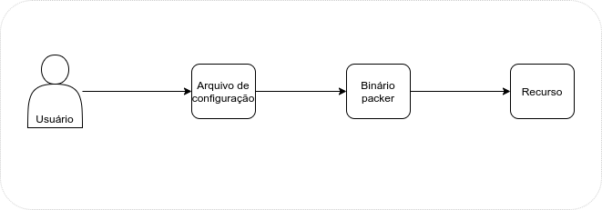

# packer na prática


O objetivo dessa documentação e trazer alguns conceitos do packer de forma pratica. Utilizando exemplos e implementando conceitos que tem na documentação da ferramenta.  [Documentação](https://www.packer.io/intro)

**Obs.**: Para colocar em pratica os conceitos sera criada uma AMI na cloud AWS. **Como o foco da documentação é mostra em detalhes o packer alguns conceito da AWS serão abstraidos, conceitos como:**

- [IAM](https://blog.convisoappsec.com/arquitetura-imutavel-em-appsec/)

- [AMI](https://blog.convisoappsec.com/arquitetura-imutavel-em-appsec/)

- [CREDENTIALS](https://blog.convisoappsec.com/arquitetura-imutavel-em-appsec/)


## Introdução

## O que é packer? o que faz? onde vive ?

 _Packer_ é uma ferramenta de código aberto para a criação de imagens de máquina idênticas para várias plataformas a partir de uma configuração de origem única. O _Packer_ consegue criar imagens de máquina para várias plataformas em paralelo além de ser uma excelente ferramenta para utilizar o conceito de **Infraestrutura imutável** pois é possivel manter as configurações de uma maquina da mesma forma que foi criada. 

Para obter mais detalhes do que é **Infraestrutura imutável** esse link ajudara a entender. [Arquitetura Imutavel](https://blog.convisoappsec.com/arquitetura-imutavel-em-appsec/)

## Forma de trabalho



**Arquivo de configuração:** É a parti desse aquivo que vamos detalhar o que tera na imagens da maquina, atualmente temos duas opções de escrita desse arquivo:

[JSON](https://blog.convisoappsec.com/arquitetura-imutavel-em-appsec/)

[HCL](https://blog.convisoappsec.com/arquitetura-imutavel-em-appsec/)

**Binário packer:**  O binario do packer ira interpreta o que esta escrito no arquivo de configuração e ira criar um novo recurso;

**Recurso:**  Basicamente é a imagem criada pelo packer porém como o packer pode criar imagens para diversas plataformas e cada plataforma tem uma nomeclatura diferente o nome _recurso_ serve para identificar o resultado final.

## Instalando o packer

Como o packer é um binario a sua instalação é bem simples e pode ser feita consultando da [documentação](https://learn.hashicorp.com/tutorials/packer/getting-started-install)

## Arquivo de configuração

Conforme mostra acima temos uma arquivo que declaramos como sera criada a nossa imagem. Esse arquivo é conhecido como **template**.

O template pode ser escrito em json ou hcl, para esse exemplos iremos escreve em hcl tendo em vista que a propria hashicorp esta orientando fazer essas mudança de json para hcl. [Documentação](https://www.packer.io/docs/templates)

Template de exemplo
```
variable "ami_name" {
  type    = string
  default = "my-custom-ami"
}

locals { timestamp = regex_replace(timestamp(), "[- TZ:]", "") }

source "amazon-ebs" "example" {
  access_key    = "${var.aws_access_key}"
  ami_name      = "packer example ${local.timestamp}"
  instance_type = "t2.micro"
  region        = "us-east-1"
  secret_key    = "${var.aws_secret_key}"
  source_ami_filter {
    filters = {
      name                = "ubuntu/images/*ubuntu-xenial-16.04-amd64-server-*"
      root-device-type    = "ebs"
      virtualization-type = "hvm"
    }
    most_recent = true
    owners      = ["099720109477"]
  }
  ssh_username = "ubuntu"
}

build {
  sources = ["source.amazon-ebs.example"]

}


```
